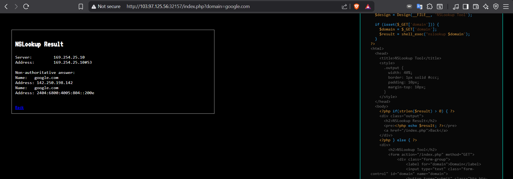
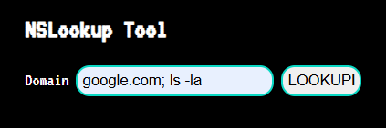
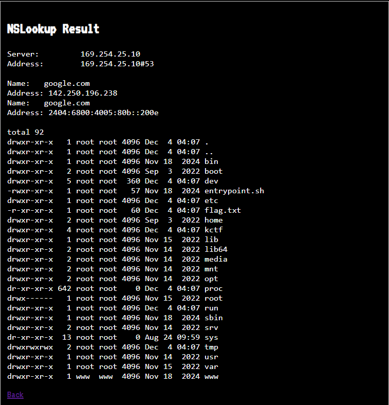
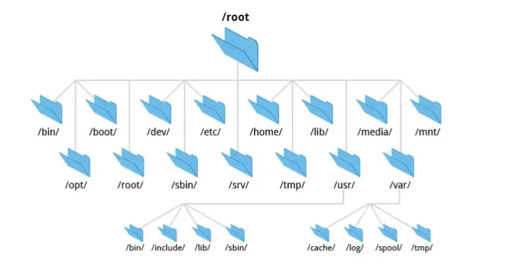
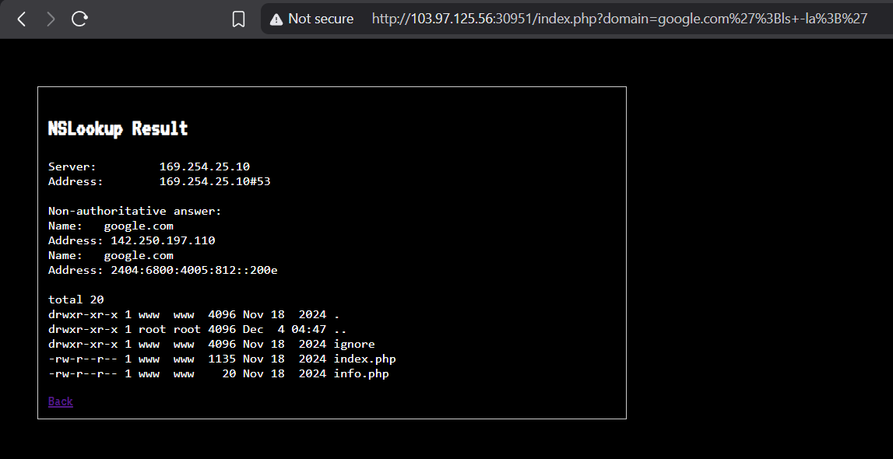
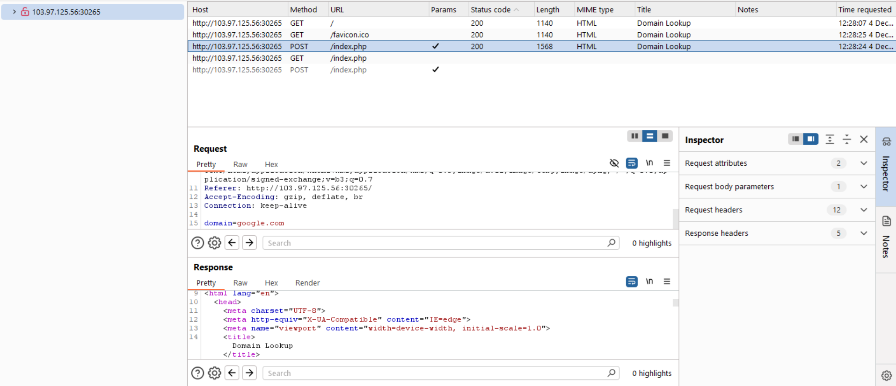
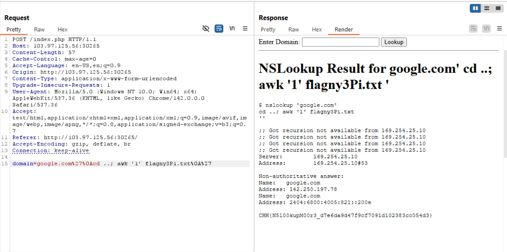

# NSLookup-level-1-2-3-CookieArena-CTF-Challenge-Writeup


Chào các bạn! write-up này mình sẽ đi ngắn gọn về các bước khi mà mình solve 3 bài challenge về Web, cụ thể là method Command Injection trên Battle CookieArena. Gét gô!!

#### NSLookup level 1
UI của trang web


nó đơn giản là 1 cái nslookup online khi nhập 1 domain bất kì nào vào thì nó sẽ đưa ra kết quả truy vấn



Vì đề bài của challenge này là command injection và bài này quá dễ nên mình sẽ có payload như sau: 



```
[domain]; ls -la
```
nói sơ qua thì dấu `;` dùng để chạy lệnh liên tiếp, còn `ls -la` sẽ hiển chi tiết và đầy đủ các file


giờ thì chỉ cần `[domain]; cd ..` để về thư mục trước đó 



**cấu trúc của file system hierarchy**



thấy file `flag.txt` rồi thì `cat` thôi hé


lụm key rồi qua challenge tiếp theo he

#### NSLookup level 2
UI của challenge này cũng y hệt bài trước, nhưng có cái các command của nó đã bị filtered. 


sau khi thử một số dấu để thực thi trong shell thì dấu `'` (single quote) chạy được :v 
cho nên mình thử với payload `';ls -la;'`



ta thấy được dấu `'` để đóng chuỗi, `;` để tách lệnh, rồi chạy `ls -la` như một lệnh độc lập

ok ra rồi thì mình làm y như bước challenge 1 nhưng đổi lại payload của bài này


```
[domain]';cd ..; cat flag.txt;'
```
submit flag xong qua challenge cuối

#### NSLookup level 3
Đề bài:
(*Tất cả các lệnh đọc file 'cat', 'head', 'tail', 'less', 'strings', 'nl', "ls"*, " * ", *"curl", "wget" đều bị chặn và không tồn tại trên hệ thống*)
(*Flag: /flagXXXX.txt*)


có thể thấy từ đề bài thì sever bị filtered khá nhiều nên cách thử thủ công không còn khả thi lắm nên mình sử dụng Intruder trong Burpsuit để test nhiều payload cùng lúc



nhập đại domain vô bắt được gói POST rồi thì chuột phải rồi send to Intruder


tới đây rồi thì mình add thêm giá trị sau domain và sử dụng các payload có sẵn (mình có để ở trên) paste vô payload configuration 


sau một hồi thì cũng có kết quả với payload `%27%0A/usr/bin/id%0A%27`khi nó hiện ra id

send payload đó vô Repeater để test


như đề bài thì sever đã filtered `ls` nên mình sử dụng command khác là `vdir -a` có chức năng tương tự để xem các file

tới đây rồi thì `cd` về thư mục cha và xem tiếp


thấy được file flag rồi, theo đề thì format file flag là `flagXXXX` nên mình sẽ đua cái `flagny3Pi.txt`

và sever cũng đã filtered `cat` rồi nên mình sử dụng `awk '1'` có chức năng tương tự in toàn bộ nội dung file ra



>3 bài này là các bài cơ bản nhập môn vào mảng Web và hiểu về shell_exec. Chúc mấy fen học giỏi!

THE END


